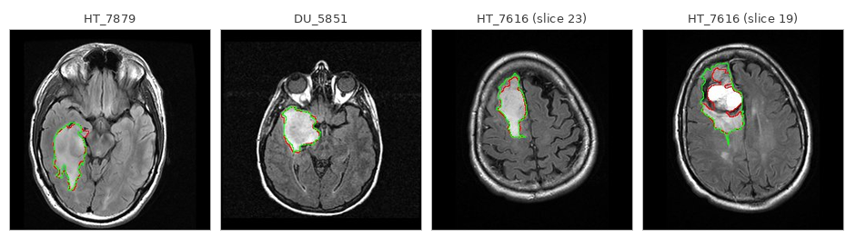

# Brain MRI FLAIR Abnormality Segmentation

U-Net trained on the [LGG Segmentation Dataset](https://www.kaggle.com/datasets/mateuszbuda/lgg-mri-segmentation) to automatically delineate FLAIR signal abnormalities in brain MRI. Trained and evaluated on the TCGA lower-grade glioma cohort.

---

## Architecture


Standard U-Net with four encoder stages, a bottleneck, and four symmetric decoder stages with skip connections. Each encoder/decoder stage is a double conv block: `Conv3×3 → BN → ReLU → Conv3×3 → BN → ReLU`. Decoder stages upsample via transposed convolution and concatenate the matching encoder features before the double conv.

| Stage | Feature maps | Spatial resolution |
|---|---|---|
| Encoder 1 | 32 | 256 × 256 |
| Encoder 2 | 64 | 128 × 128 |
| Encoder 3 | 128 | 64 × 64 |
| Encoder 4 | 256 | 32 × 32 |
| Bridge | 512 | 16 × 16 |
| Decoder 4 | 256 | 32 × 32 |
| Decoder 3 | 128 | 64 × 64 |
| Decoder 2 | 64 | 128 × 128 |
| Decoder 1 | 32 | 256 × 256 |
| Output head | 1 (sigmoid) | 256 × 256 |

---

## Dataset

The [LGG Segmentation Dataset](https://www.kaggle.com/datasets/mateuszbuda/lgg-mri-segmentation) contains brain MRI scans from 110 patients with lower-grade glioma from The Cancer Genome Atlas (TCGA). Each patient folder has multi-sequence MRI (pre-contrast T1, FLAIR, post-contrast T1) with expert-annotated tumour masks. The model takes all three channels as input and predicts a single binary segmentation mask.

**Split:** 100 patients training / 10 patients validation (random, seed 42).

---

## Results

### Per-patient Dice coefficient


| Metric | Value |
|---|---|
| Mean DSC | ~0.90 |
| Median DSC | ~0.92 |

Performance is strong across the board — nine of ten validation patients score above 0.88, with the top four (DU_6404, CS_6667, DU_6408, DU_5851) all exceeding 0.93. The one weaker result is HT_7616 at roughly 0.80, which has a large tumour with diffuse, irregular margins that extend across multiple lobes. The model handles it reasonably but predictably undershoots on the infiltrating edges. This kind of case is genuinely harder and the score reflects that honestly.

### Sample predictions



*Red contour = prediction · Green contour = ground truth*

Left to right: HT_7879 and DU_5851 show near-perfect contour agreement on compact, well-defined lesions. HT_7616 (slice 23) demonstrates the same on a smaller lesion. HT_7616 (slice 19) is the harder case — the model tracks the tumour core correctly but the ground truth extends further into the surrounding diffuse signal, which is where the gap in that patient's overall Dice score comes from.

---

## Training curves

*(TensorBoard logs — coming soon)*

---

## Quickstart

### 1. Install dependencies

```bash
pip install torch torchvision medpy scikit-image matplotlib tqdm tensorboard pillow kagglehub
```

### 2. Download data

```bash
python get_data.py
```

### 3. Train

```bash
python train.py \
  --data-dir ./kaggle_3m \
  --epochs 100 \
  --lr 1e-4 \
  --batch-size 16 \
  --device cuda:0
```

The best checkpoint is saved to `./checkpoints/best_model.pt` whenever validation Dice improves.

### 4. Run inference

```bash
# If the model was saved with torch.compile, strip the _orig_mod. prefix first:
python fix_model.py

python predict.py \
  --model-path ./checkpoints/best_model.pt \
  --data-dir ./kaggle_3m \
  --output-dir ./predictions \
  --figure-path ./assets/dice_distribution.png
```

---

## Configuration

All training hyperparameters are saved to `./tb_logs/config.json` at the start of each run.

| Parameter | Default | Description |
|---|---|---|
| `batch_size` | 16 | Training batch size |
| `epochs` | 100 | Number of training epochs |
| `lr` | 1e-4 | Initial learning rate (cosine annealing) |
| `image_size` | 256 | Spatial resolution after preprocessing |
| `aug_scale` | 0.05 | Random scale range ±5% |
| `aug_angle` | 15.0 | Random rotation ±15° |

---

## Project structure

```
.
├── train.py              # Training loop with TensorBoard logging
├── predict.py            # Inference, postprocessing, Dice evaluation
├── dataset.py            # MRISegmentationDataset (slice-level PyTorch Dataset)
├── network.py            # UNetModel
├── losses.py             # SoftDiceLoss
├── augmentations.py      # Random scale / rotation / flip pipeline
├── utils.py              # Preprocessing, Dice metric, visualization helpers
├── tb_logger.py          # TensorBoard wrapper
├── fix_model.py          # Strip torch.compile prefix from checkpoints
├── get_data.py           # Kaggle dataset download utility
├── hubconf.py            # torch.hub entry point
└── assets/
    ├── unet_architecture.png
    ├── dice_distribution.png
    └── predictions_grid.png
```

---

## Loss function

Training uses **Soft Dice Loss** computed per-sample and per-channel:

$$\mathcal{L} = 1 - \frac{1}{N} \sum_{i=1}^{N} \frac{2 \sum p_i \cdot g_i + \epsilon}{\sum p_i + \sum g_i + \epsilon}$$

where $p_i$ are predicted probabilities and $g_i$ are binary ground-truth labels. Laplace smoothing $\epsilon = 1$ prevents division by zero and stabilises gradients on empty slices — most brain slices contain no tumour at all, so this matters in practice.

---

## License

MIT
