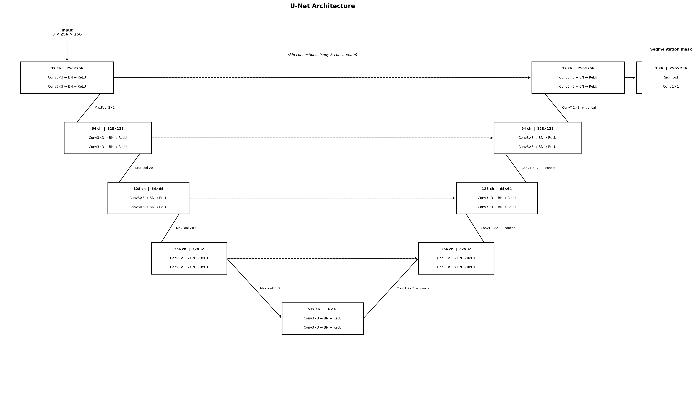
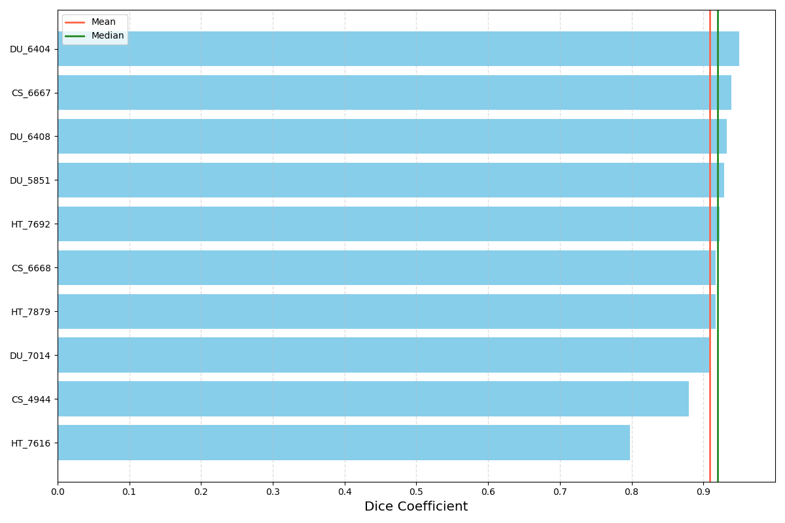

# Brain MRI FLAIR Abnormality Segmentation

A U-Net implementation for automatic segmentation of FLAIR abnormalities in brain MRI scans, trained on the [LGG Segmentation Dataset](https://www.kaggle.com/datasets/mateuszbuda/lgg-mri-segmentation) (Kaggle / TCIA).

---

## Architecture



The model is a standard U-Net with four encoder stages, a bottleneck bridge, and four decoder stages with skip connections:

| Stage | Feature maps | Spatial resolution |
|---|---|---|
| Encoder 1 | 32 | 256 × 256 |
| Encoder 2 | 64 | 128 × 128 |
| Encoder 3 | 128 | 64 × 64 |
| Encoder 4 | 256 | 32 × 32 |
| Bridge | 512 | 16 × 16 |
| Decoder 4 | 256 | 32 × 32 |
| Decoder 3 | 128 | 64 × 64 |
| Decoder 2 | 64 | 128 × 128 |
| Decoder 1 | 32 | 256 × 256 |
| Output head | 1 (sigmoid) | 256 × 256 |

Each encoder/decoder stage is a double conv block: `Conv3×3 → BN → ReLU → Conv3×3 → BN → ReLU`. Decoder stages concatenate transposed convolution output with the matching encoder skip features.

---

## Dataset

The [LGG Segmentation Dataset](https://www.kaggle.com/datasets/mateuszbuda/lgg-mri-segmentation) contains brain MRI scans from 110 patients with lower-grade glioma, sourced from The Cancer Genome Atlas (TCGA). Each patient has multi-sequence MRI (pre-contrast T1, FLAIR, post-contrast T1) with expert-annotated tumour masks.

**Split:** 100 patients training / 10 patients validation (random, seed 42).

---

## Results

> ⚠️ Results will be updated after bug fixes and re-training.

### Per-patient Dice coefficient distribution



| Metric | Value |
|---|---|
| Mean DSC | — |
| Median DSC | — |

### Sample predictions

| MRI (FLAIR channel) | Ground truth | Prediction |
|---|---|---|
| *(coming soon)* | | |

Red contour = prediction · Green contour = ground truth

---

## Training curves

> *(TensorBoard logs — coming soon)*

---

## Quickstart

### 1. Install dependencies

```bash
pip install torch torchvision medpy scikit-image matplotlib tqdm tensorboard pillow kagglehub
```

### 2. Download data

```bash
python get_data.py
```

### 3. Train

```bash
python train.py \
  --data-dir ./kaggle_3m \
  --epochs 100 \
  --lr 1e-4 \
  --batch-size 16 \
  --device cuda:0
```

The best checkpoint is saved to `./checkpoints/best_model.pt` whenever validation Dice improves.

### 4. Run inference

```bash
# If the model was saved with torch.compile, strip the _orig_mod. prefix first:
python fix_model.py

python predict.py \
  --model-path ./checkpoints/best_model.pt \
  --data-dir ./kaggle_3m \
  --output-dir ./predictions \
  --figure-path ./assets/dice_distribution.png
```

---

## Configuration

All training hyperparameters are saved to `./tb_logs/config.json` at the start of each run.

| Parameter | Default | Description |
|---|---|---|
| `batch_size` | 16 | Training batch size |
| `epochs` | 100 | Number of training epochs |
| `lr` | 1e-4 | Initial learning rate (cosine annealing) |
| `image_size` | 256 | Spatial resolution after preprocessing |
| `aug_scale` | 0.05 | Random scale range ±5% |
| `aug_angle` | 15.0 | Random rotation ±15° |

---

## Project structure

```
.
├── train.py              # Training loop with TensorBoard logging
├── predict.py            # Inference, postprocessing, Dice evaluation
├── dataset.py            # MRISegmentationDataset (slice-level PyTorch Dataset)
├── network.py            # UNetModel
├── losses.py             # SoftDiceLoss
├── augmentations.py      # Random scale / rotation / flip pipeline
├── utils.py              # Preprocessing, Dice metric, visualization helpers
├── tb_logger.py          # TensorBoard wrapper
├── fix_model.py          # Strip torch.compile prefix from checkpoints
├── get_data.py           # Kaggle dataset download utility
├── hubconf.py            # torch.hub entry point
└── assets/
    ├── unet_architecture.png
    └── dice_distribution.png
```

---

## Loss function

Training uses **Soft Dice Loss** computed per-sample, per-channel:

$$\mathcal{L} = 1 - \frac{1}{N} \sum_{i=1}^{N} \frac{2 \sum p_i \cdot g_i + \epsilon}{\sum p_i + \sum g_i + \epsilon}$$

where $p_i$ are predicted probabilities and $g_i$ are binary ground-truth labels. Laplace smoothing $\epsilon = 1$ prevents division by zero and stabilises gradients on empty slices.

---

## License

MIT
