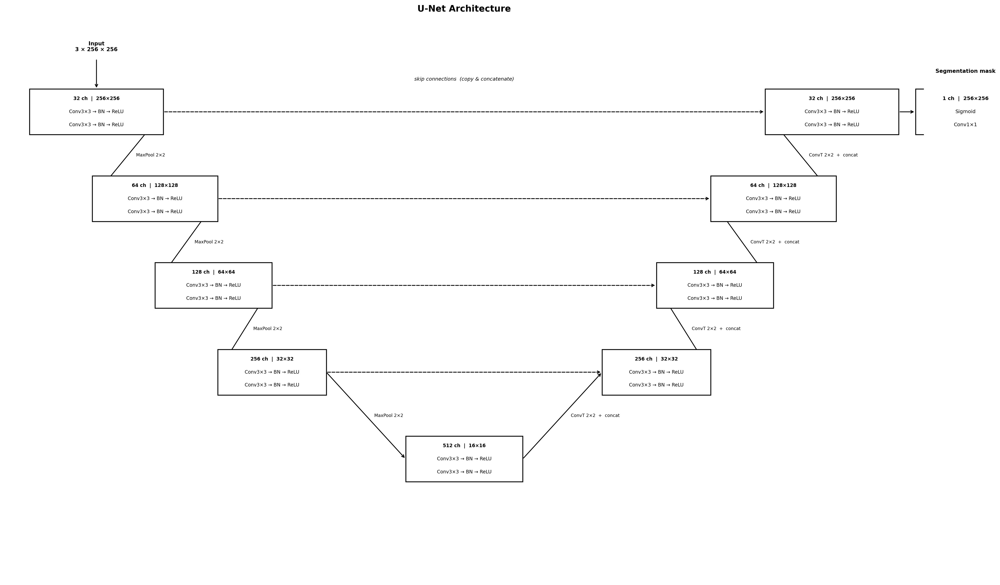
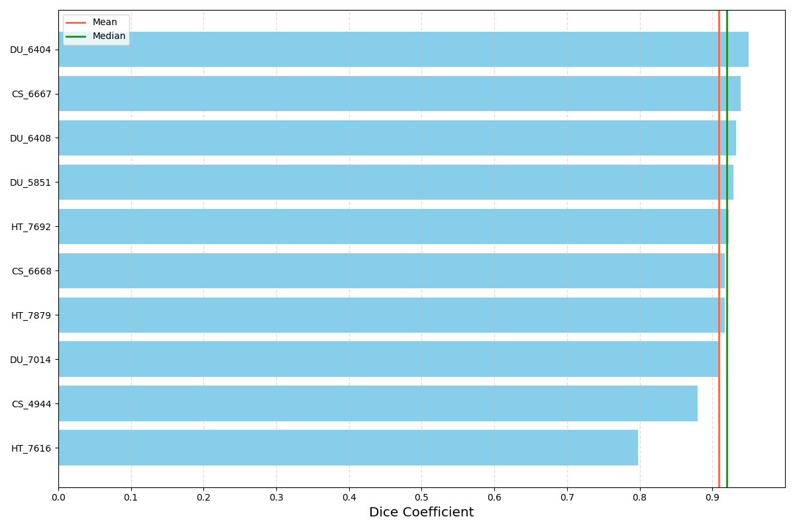
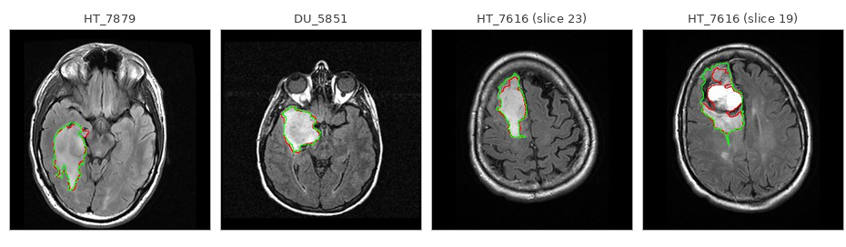

# Brain MRI FLAIR Abnormality Segmentation

U-Net trained on the [LGG Segmentation Dataset](https://www.kaggle.com/datasets/mateuszbuda/lgg-mri-segmentation) to automatically delineate FLAIR signal abnormalities in brain MRI. Trained and evaluated on the TCGA lower-grade glioma cohort.

---

## Architecture



Standard U-Net with four encoder stages, a bottleneck, and four symmetric decoder stages with skip connections. Each encoder/decoder stage is a double conv block: `Conv3×3 → BN → ReLU → Conv3×3 → BN → ReLU`. Decoder stages upsample via transposed convolution and concatenate the matching encoder features before the double conv.

| Stage | Feature maps | Spatial resolution |
|---|---|---|
| Encoder 1 | 32 | 256 × 256 |
| Encoder 2 | 64 | 128 × 128 |
| Encoder 3 | 128 | 64 × 64 |
| Encoder 4 | 256 | 32 × 32 |
| Bridge | 512 | 16 × 16 |
| Decoder 4 | 256 | 32 × 32 |
| Decoder 3 | 128 | 64 × 64 |
| Decoder 2 | 64 | 128 × 128 |
| Decoder 1 | 32 | 256 × 256 |
| Output head | 1 (sigmoid) | 256 × 256 |

---

## Dataset

The [LGG Segmentation Dataset](https://www.kaggle.com/datasets/mateuszbuda/lgg-mri-segmentation) contains brain MRI scans from 110 patients with lower-grade glioma from The Cancer Genome Atlas (TCGA). Each patient folder has multi-sequence MRI (pre-contrast T1, FLAIR, post-contrast T1) with expert-annotated tumour masks. The model takes all three channels as input and predicts a single binary segmentation mask.

**Split:** 100 patients training / 10 patients validation (random, seed 42).

---

## Results

### Per-patient Dice coefficient



| Metric | Value |
|---|---|
| Mean DSC | ~0.90 |
| Median DSC | ~0.92 |

Performance is strong across the board — nine of ten validation patients score above 0.88, with the top four (DU_6404, CS_6667, DU_6408, DU_5851) all exceeding 0.93. The one weaker result is HT_7616 at roughly 0.80, which has a large tumour with diffuse, irregular margins that extend across multiple lobes. The model handles it reasonably but predictably undershoots on the infiltrating edges. This kind of case is genuinely harder and the score reflects that honestly.

### Sample predictions



*Red contour = prediction · Green contour = ground truth*

Left to right: HT_7879 and DU_5851 show near-perfect contour agreement on compact, well-defined lesions. HT_7616 (slice 23) demonstrates the same on a smaller lesion. HT_7616 (slice 19) is the harder case — the model tracks the tumour core correctly but the ground truth extends further into the surrounding diffuse signal, which is where the gap in that patient's overall Dice score comes from.

---

## Training curves

*(TensorBoard logs — coming soon)*

---

## Quickstart

### 1. Install dependencies

```bash
pip install torch torchvision medpy scikit-image matplotlib tqdm tensorboard pillow kagglehub
# or: uv sync

# Optional, for ONNX export / ONNX Runtime and for TensorRT 11.3 engines (NVIDIA GPU):
uv sync --group onnx --group tensorrt
```

### 2. Download data

```bash
python get_data.py
```

### 3. Train

```bash
python train.py \
  --data-dir ./kaggle_3m \
  --epochs 100 \
  --lr 1e-4 \
  --batch-size 16 \
  --device cuda:0 \
  --compile default        # torch.compile mode: none | default | reduce-overhead | max-autotune | max-autotune-no-cudagraphs
```

The best checkpoint is saved to `./checkpoints/best_model.pt` whenever validation Dice improves.
It is always saved from the uncompiled model, so it loads with or without `torch.compile`.

### 4. Run inference

```bash
python predict.py \
  --model-path ./checkpoints/best_model.pt \
  --data-dir ./kaggle_3m \
  --output-dir ./predictions \
  --figure-path ./assets/dice_distribution.png
```

The backend follows the model file: `.pt` → PyTorch (add `--compile` and/or `--amp` for torch.compile / fp16
autocast), `.onnx` → ONNX Runtime, `.engine` / `.plan` → TensorRT. Checkpoints saved from a `torch.compile`d model
(`_orig_mod.` key prefix) are loaded directly; `fix_model.py` is no longer needed.

### 5. Compare architectures (K-fold CV)

```bash
bash run_cv.sh            # trains + tests every arch/fold, runs aggregate.py and compare.py, bundles models into ./models
python compare.py --runs-dir ./runs --baseline unet   # redraw figures any time, no GPU or dataset needed
```

`run_cv.sh` reads `ARCHS`, `FOLDS`, `SEEDS`, `EPOCHS`, `DATA_DIR`, `RUNS_DIR`, `MODELS_DIR`, `COMPILE` (torch.compile
mode for training, default `default`) and `EXPORT_FORMATS` (see [ONNX and TensorRT](#8-onnx-and-tensorrt)) from the
environment, e.g. `COMPILE=none EXPORT_FORMATS="fp32.onnx fp16.engine" bash run_cv.sh`.

Per run, `runs/<arch>/fold<k>_seed<s>/` holds `test_results.json` (per-patient Dice, Dice without LCC, HD95),
`test_masks.npz` (FLAIR, ground truth, predicted mask and probability map per test patient), `logs/history.csv`
(per-epoch losses, val Dice, lr, time) and the checkpoint. Runs finished before `test_masks.npz` existed are back-filled by
re-running `run_cv.sh` (inference only, no retraining).

`compare.py` writes to `runs/figures/`:

| File | Shows |
|---|---|
| `metric_distributions.png` | Per-patient Dice and HD95 per architecture (box + individual patients) |
| `paired_dice_vs_baseline.png` | Each patient's Dice for an architecture vs the baseline; above the diagonal = better |
| `fold_mean_dice.png` | Mean test Dice per fold and architecture |
| `dice_vs_tumour_volume.png` | Per-patient Dice against ground-truth tumour size |
| `training_curves.png` | Train loss, val loss and val Dice per epoch (mean ± std over folds) |
| `segmentation_overview.png` | Worst / median / best test patients side by side for every architecture |
| `segmentation/<patient>.png` | Per patient: largest-tumour, most-errors and tumour-edge slices; columns FLAIR, ground truth, each architecture |
| `<arch>/all_patients.png` | Gallery of one architecture: every test patient on its largest-tumour slice, lowest Dice first |
| `<arch>/cases/<worstN\|medianN\|bestN>_<patient>.png` | The `--gallery-cases` (default 3) worst, median and best patients of one architecture: several slices with FLAIR, ground truth, prediction errors and the probability map |

Overlay colours: green = correct, red = false positive, blue = missed, yellow = ground truth.
The probability column needs `test_masks.npz` written by the current `predict.py`; older files are drawn without it.

### 6. Saved models for later prediction (fold ensembles)

K-fold CV trains one model per fold, and each fold's test Dice is measured on patients that model never saw.
`export_models.py` (run at the end of `run_cv.sh`) copies all fold models of an architecture into one bundle:

```
models/<arch>/manifest.json            # arch, image size; per member: fold, seed, val Dice, best epoch (0-based), held-out test Dice
models/<arch>/fold<k>_seed<s>/model.pt # plus model.fp32.onnx, model.fp16.engine, ... when exported
```

`predict.py --bundle-dir` averages the probabilities of all members (a K-fold ensemble), on new patients in the
Kaggle folder layout:

```bash
python predict.py --bundle-dir ./models/unet --split all --data-dir ./new_patients --output-dir ./new_predictions
python predict.py --bundle-dir ./models/unet --bundle-file model.fp16.engine --split all --data-dir ./new_patients
```

The ensemble is refused on `--split validation/test`: every CV patient was a training patient of the other folds'
models, so any score there would be inflated. The CV results in `summary.csv` estimate the performance of a single
fold model; the ensemble has no held-out estimate of its own.
Like all of `predict.py`, the ensemble still reads the `*_mask.tif` files (Dice is reported against them) and writes
masks on the preprocessed 256 × 256 grid, not the original scan geometry.

### 7. torch.compile

`--compile MODE` (train.py, predict.py, benchmark.py) wraps the model with `torch.compile`; `none` runs eager PyTorch.
Training compiles by default (as before); prediction and benchmarking run eagerly by default.

* **Same model, not bit-identical numbers.** Inductor fuses operations and picks different kernels, so outputs differ
  from eager mode at the level of floating-point rounding (measured on CPU: max |Δp| 6e-8 for U-Net and 8e-7 for
  Swin-UNETR in fp32, no pixel changed class at the 0.5 threshold). Test Dice is therefore essentially unchanged.
* **Training runs diverge slightly.** Those rounding differences compound over thousands of optimizer steps, so a
  compiled and an eager training run with the same seed end at slightly different weights, like two runs with
  non-deterministic cuDNN kernels. Compare architectures with the same compile mode.
* **Speed.** The first batches are slow while compiling (35-85 s per architecture measured on CPU; switching to eval
  mode and a smaller last batch each trigger a recompile), later steps are usually faster on GPU. `reduce-overhead` adds CUDA
  graphs (more memory), `max-autotune` benchmarks kernels (much longer compile).
* `bash run_backend_eval.sh` with `VARIANTS=compile` measures the test Dice of every fold model with torch.compile.

### 8. ONNX and TensorRT

```bash
EXPORT_FORMATS="fp32.onnx fp16.onnx fp32.engine fp16.engine" bash run_cv.sh   # or, after training:
python export_models.py --runs-dir ./runs --out-dir ./models --formats fp32.onnx fp16.onnx fp32.engine fp16.engine --overwrite
bash run_backend_eval.sh    # test Dice per backend -> runs/summary.<variant>.csv
python benchmark.py --backends pytorch fp32.onnx fp32.engine fp16.engine --out ./runs/compute_benchmark.json
```

* **ONNX:** exported with PyTorch's `torch.export`-based exporter (opset 20, dynamic batch, fixed H × W).
  `fp16.onnx` is an fp16 copy of the model (weights, activations, input and output).
* **TensorRT 11.3:** TensorRT 11 networks are always strongly typed (the FP16 builder flag no longer exists), so the
  engine precision comes from the ONNX file: `fp16.engine` is built from `fp16.onnx`. `fp32.engine` lets
  convolutions use TF32 tensor cores (TensorRT's default; `--no-tf32` disables it). Engines accept batch sizes 1 to
  `--max-batch` (default 32; larger batches are split) and only run with the TensorRT version and GPU model they were
  built with, so rebuild them on each machine.
* After each export, `export_models.py` prints the largest probability difference to the fp32 PyTorch model on a
  random batch as a sanity check; `run_backend_eval.sh` gives the real accuracy comparison on the test folds.
* The TensorRT path requires an NVIDIA GPU and was written against the TensorRT 11.3 Python API; its test
  (`tests/test_export_models.py::test_tensorrt_engine_matches_pytorch`) is skipped on machines without one.

### 9. Run tests

```bash
uv sync --group onnx   # pytest and mypy are in the dev dependency group
pytest                 # ~50 s on CPU; synthetic data only, no dataset needed. ONNX tests skip without the onnx group
mypy .                 # every function must be fully type-annotated (see [tool.mypy] in pyproject.toml)
```

---

## Configuration

All training hyperparameters are saved to `./tb_logs/config.json` at the start of each run.

| Parameter | Default | Description |
|---|---|---|
| `batch_size` | 16 | Training batch size |
| `epochs` | 100 | Number of training epochs |
| `lr` | 1e-4 | Initial learning rate (cosine annealing) |
| `image_size` | 256 | Spatial resolution after preprocessing |
| `aug_scale` | 0.05 | Random scale range ±5% |
| `aug_angle` | 15.0 | Random rotation ±15° |
| `compile` | default | `torch.compile` mode, or `none` for eager PyTorch |

---

## Project structure

```
.
├── train.py              # Training loop with TensorBoard logging
├── predict.py            # Inference (PyTorch / ONNX Runtime / TensorRT, single model or fold ensemble), Dice evaluation
├── inference.py          # Inference backends, torch.compile helper, fold-ensemble loading
├── export_models.py      # Per-architecture model bundles, ONNX export, TensorRT engine build
├── benchmark.py          # Parameters, FLOPs, latency and memory per architecture and backend
├── evaluation.py         # Per-patient metrics (raw Dice, HD95) and results JSON
├── aggregate.py          # CV summary table with Wilcoxon tests against the baseline
├── compare.py            # Comparison figures across architectures and per-architecture galleries
├── run_cv.sh             # K-fold CV for every architecture, then aggregate, compare and export
├── run_backend_eval.sh   # Test Dice of every fold model with torch.compile / ONNX / TensorRT
├── tests/                # pytest unit tests (metrics, preprocessing, splits, aggregation, figures, backends, export)
├── dataset.py            # MRISegmentationDataset (slice-level PyTorch Dataset)
├── network.py            # UNetModel, ResUNetModel, SwinUNETRModel and ModelFactory
├── losses.py             # SoftDiceLoss
├── augmentations.py      # Random scale / rotation / flip pipeline
├── utils.py              # Preprocessing, Dice metric, visualization helpers
├── tb_logger.py          # TensorBoard wrapper
├── fix_model.py          # Strip torch.compile prefix from checkpoints
├── get_data.py           # Kaggle dataset download utility
├── hubconf.py            # torch.hub entry point
└── assets/
    ├── unet_architecture.png
    ├── dice_distribution.png
    └── predictions_grid.png
```

---

## Loss function

Training uses **Soft Dice Loss** computed per-sample and per-channel:

$$\mathcal{L} = 1 - \frac{1}{N} \sum_{i=1}^{N} \frac{2 \sum p_i \cdot g_i + \epsilon}{\sum p_i + \sum g_i + \epsilon}$$

where $p_i$ are predicted probabilities and $g_i$ are binary ground-truth labels. Laplace smoothing $\epsilon = 1$ prevents division by zero and stabilises gradients on empty slices — most brain slices contain no tumour at all, so this matters in practice.

---

## License

MIT
